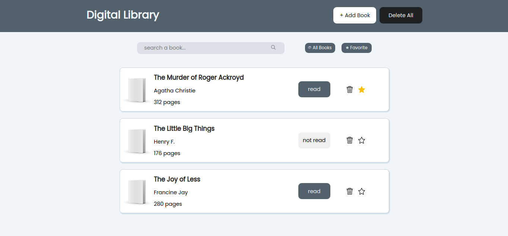
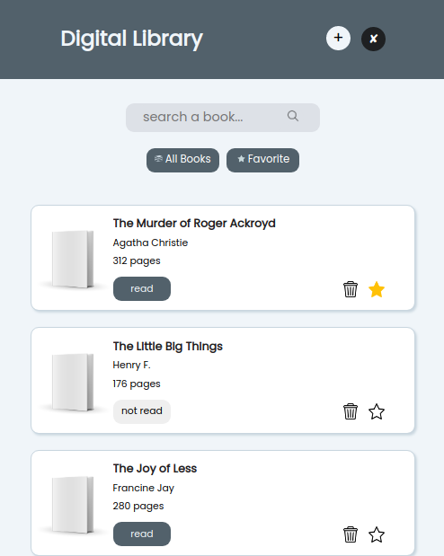

# library

[click here](https://lemonaisu888.github.io/library) for live preview!

#### Desktop ver.

#### Mobile ver.

## Technologies I Used
* OS: Linux Ubuntu
* Text Editor: VS Code
* Source control provider: GitHub
* Tech stack:
    * HTML
    * CSS
    * JavaScript

## Outcomes
Throughout this project, I gained some new skills which I can apply into other projects in the future, such as:
* Duplicating a specific type of object using object constructors.
* Using `document.createElement()` to dynamically create HTML elements, and append it to the document by using `document.appendChild()`.
* How to add responsiveness using media quieries.

## Source
* [Image by macrovector](https://www.freepik.com/free-vector/blank-book-cover-white-vector-illustration_10601351.htm#query=blank%20book&position=24&from_view=search&track=sph) on Freepik
* Credits to various owners for the icons from Flaticon.